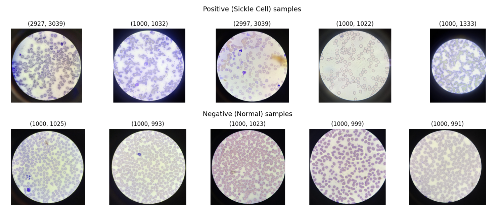

# SickleShield 🛡️

*Screen first. Travel smart.*

SickleShield is a two-component machine learning **triage** system that helps identify Sickle Cell Disease risk in rural and tribal communities in India, where the disease remains critically underdiagnosed. A self-reported symptom questionnaire flags high-risk individuals before they travel to a diagnostic centre, and a blood smear image classifier lets health workers at primary health centres detect sickle cells on the spot without sending samples to a distant city lab.

**What is triage?**
Triage means quickly sorting who needs urgent medical attention and who doesn't. Think of it as a first filter. Instead of sending everyone to a hospital, SickleShield first checks whether you are actually at risk. If you are, you go get tested. If you are not, you have saved yourself a long and expensive trip.


## The Problem

Sickle Cell Disease disproportionately affects tribal communities across Chhattisgarh, Madhya Pradesh, Odisha, and Gujarat. Getting diagnosed means travelling hours to a city lab for a specialised blood test. Many families make that trip only to get a negative result. ICMR launched a National Sickle Cell Anaemia Mission in 2023, training 21,000 frontline workers, yet screening infrastructure remains sparse in the most affected regions.

A family in rural Chhattisgarh cannot know if they are at risk without travelling to a city lab. SickleShield is built to change that.


## How It Works

```
Patient at home
       |
Component 1: Answers a simple symptom questionnaire
(age, family history, pain episodes, jaundice, fatigue)
       |
High risk flagged -> travel to nearest Primary Health Centre (PHC)
       |
Component 2: Health worker uploads blood smear photo
       |
Model instantly classifies: Sickle Cell Detected / Normal
       |
Refer to hospital for confirmation / All clear
```

No expensive equipment. No city lab. Just a phone and a basic microscope at the nearest PHC.


## Components

### Component 1: Symptom Risk Scorer (In Progress)

Takes only self-reported inputs. Zero equipment needed.

Input features:
- Age, gender, tribal community
- Family history of Sickle Cell Disease
- Symptoms: recurring pain episodes, yellowing of eyes (jaundice), chronic fatigue, frequent infections, swollen hands or feet

Model: XGBoost classifier

Since no large-scale public Sickle Cell symptom dataset exists, Component 1 is currently trained on an anaemia screening dataset as a proxy. Anaemia and Sickle Cell Disease share overlapping clinical features such as haemoglobin patterns, fatigue, and jaundice, which makes this a reasonable stand-in to demonstrate that the pipeline is feasible. A formal data request has been submitted to ICMR to obtain real screening data from the National Sickle Cell Anaemia Mission, which will be used to retrain this component on ground-truth tribal community data.


### Component 2: Blood Smear Image Classifier (Complete)

A health worker at a PHC photographs a blood smear slide and uploads it. The model analyses the image and flags whether sickle-shaped cells are present.

Model: ResNet18 fine-tuned via transfer learning

Training approach:
- Froze base layers, trained only the final classification layer (10 epochs)
- Unfroze the last ResNet block (layer4) and retrained with differential learning rates to improve accuracy without overfitting (10 more epochs)
- Class imbalance of 5.74:1 handled with weighted CrossEntropyLoss
- Data augmentation: random flips, rotation, colour jitter

Sample blood smear images used for training:



Results:

| Metric | Value |
|---|---|
| Overall Accuracy | 96% |
| Sickle Cell Recall | 98% |
| Sickle Cell F1 | 0.98 |
| Macro F1 | 0.91 |
| Normal Recall | 86% |


Limitations:
- Normal class recall (86%) is limited by the small negative class size (147 images). The model has seen far more sickle cell images than normal ones during training.
- The dataset is sourced from Uganda, not India. Cell morphology is consistent across populations so results are expected to generalise, but this will be validated once India-specific data is available.
- Both limitations will be addressed when ICMR data becomes available.


## Roadmap

| Phase | Status | Description |
|---|---|---|
| Component 2 (Image Classifier) | Complete | ResNet18, 96% accuracy |
| Component 1 (Symptom Scorer) | In Progress | XGBoost on anaemia proxy data |
| ICMR Data Request | Submitted | Real tribal screening data |
| Streamlit Interface | Planned | Health worker deployment at PHCs |
| Retrain on ICMR Data | Planned | Ground truth tribal community data |
| Multi-disease expansion | Future | TB, anaemia, hypertension triage |


## Dataset

Component 2:
- Source: Florence Tushabe et al., Sickle Cell Microscopy Dataset (Uganda)
- Paper: An Image-Based Sickle Cell Detection Method, Engineering and Applied Sciences Journal, 2025
- Size: 991 images (844 positive, 147 negative)
- Split: 80% train / 20% validation

Component 1 (proxy dataset):
- Anaemia screening dataset used to demonstrate pipeline feasibility
- Features overlap with Sickle Cell clinical indicators
- Will be replaced with ICMR National Mission screening data


## Setup

```bash
git clone https://github.com/arinova2701/SickleShield.git
cd SickleShield
pip install -r requirements.txt

# Download image dataset
kaggle datasets download -d florencetushabe/sickle-cell-disease-dataset \
  --unzip -p data/sickle

# Run notebook
jupyter notebook component2/sickle_cell_eda.ipynb
```


## Acknowledgements

Dataset: Florence Tushabe, Samuel Mwesige, Kasule Vicent et al.
Institution: Soroti University, Uganda
Funding: Government of Uganda, Soroti University Research and Innovation Fund
Motivated by: ICMR National Sickle Cell Anaemia Mission (2023)

A formal data request has been submitted to ICMR for access to National Sickle Cell Anaemia Mission screening data to retrain SickleShield on ground-truth data from tribal communities in India.
