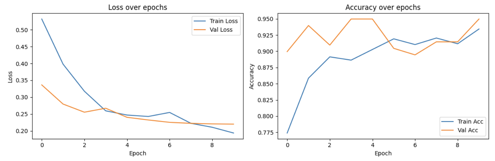
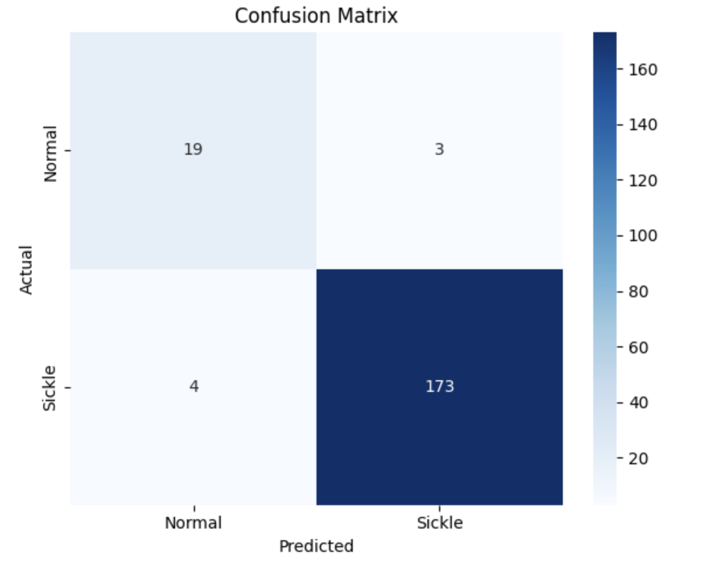

# SickleShield 🛡️

*Screen first. Travel smart.*

---

Imagine living in a village in rural Chhattisgarh.

The nearest diagnostic lab is a four-hour journey away. You've been feeling tired, with recurring joint pain. It could be Sickle Cell Disease, common in your community, or it could be nothing.

To find out, you'd lose a day of work, pay for travel, and possibly return with a negative result.

**SickleShield checks if that trip is even worth taking.**

---

## What is triage?

Triage is a first filter that sorts who needs urgent care and who doesn't. Instead of sending everyone to a hospital, SickleShield first checks if you are actually at risk, so only those who need testing make the journey.

---

## The Problem

- Sickle Cell Disease heavily affects tribal communities in Chhattisgarh, Madhya Pradesh, Odisha, and Gujarat.
- Diagnosis requires a blood test available only in city labs.
- Families travel hours, often for a negative result.
- ICMR's National Sickle Cell Mission (2023) trained 21,000 workers, but rural screening is still scarce.

---

## How It Works

```
Patient at home
      |
[1] Symptom questionnaire  ->  risk score
      |
High risk -> visit nearest PHC
      |
[2] Health worker uploads blood smear photo
      |
Model flags: Sickle Cell / Normal
      |
Refer to hospital  /  All clear
```

No costly equipment. Just a phone and a basic PHC microscope.

---

## Component 1: Symptom Risk Scorer
`In Progress`

Self-reported inputs, no equipment needed.

**Inputs:** age, gender, community, family history, pain episodes, jaundice, fatigue, frequent infections

**Model:** XGBoost

No public Sickle Cell symptom dataset exists yet, so this is trained on an **anaemia dataset as a proxy** to prove the pipeline works. The two conditions share clinical features like fatigue and jaundice. A data request is in with ICMR to retrain on real screening data.

---

## Component 2: Blood Smear Classifier
`Complete`

Health worker uploads a slide photo. Model detects sickle-shaped cells instantly.

**Model:** ResNet18, transfer learning

**Approach:**
- Trained final layer, then unfroze `layer4` with differential learning rates
- Handled 5.74:1 class imbalance with weighted loss
- Augmentation: flips, rotation, colour jitter

**Results:**

| Metric | Value |
|---|---|
| Accuracy | 96% |
| Sickle Recall | 98% |
| Sickle F1 | 0.98 |
| Macro F1 | 0.91 |
| Normal Recall | 86% |





**Limitations:**
- Normal recall (86%) limited by only 147 normal images
- Dataset is from Uganda, not India (cell shape generalises, to be validated)

---

## Roadmap

| Phase | Status |
|---|---|
| Component 2 image classifier | Done |
| Component 1 symptom scorer | In progress |
| ICMR data request | Submitted |
| Streamlit interface for PHCs | Planned |
| Retrain on ICMR data | Planned |
| Multi-disease triage (TB, anaemia) | Future |

---

## Dataset

**Component 2:** Florence Tushabe et al., Sickle Cell Microscopy Dataset (Uganda), 991 images (844 positive, 147 negative), 80/20 split.

**Component 1:** Anaemia proxy dataset, to be replaced with ICMR data.

---

## Setup

```bash
git clone https://github.com/arinova2701/SickleShield.git
cd SickleShield
pip install -r requirements.txt

kaggle datasets download -d florencetushabe/sickle-cell-disease-dataset \
  --unzip -p data/sickle

jupyter notebook component2/sickle_cell_eda.ipynb
```

---

## Acknowledgements

Dataset by Florence Tushabe, Samuel Mwesige et al., Soroti University, Uganda.
Motivated by the ICMR National Sickle Cell Anaemia Mission (2023).
